# ZPA-Backup and Restore Process

ZPA-Backup and Restore is an independent tool. It is not affiliated with, endorsed by, sponsored by, certified by, or supported by Zscaler, Inc. It is provided "as is", without warranty of any kind. See [../DISCLAIMER.md](../DISCLAIMER.md).

This page describes how the tool operates, which actions read or write a tenant, and how backup, restore, validation, and reporting fit together.

## Feature Map

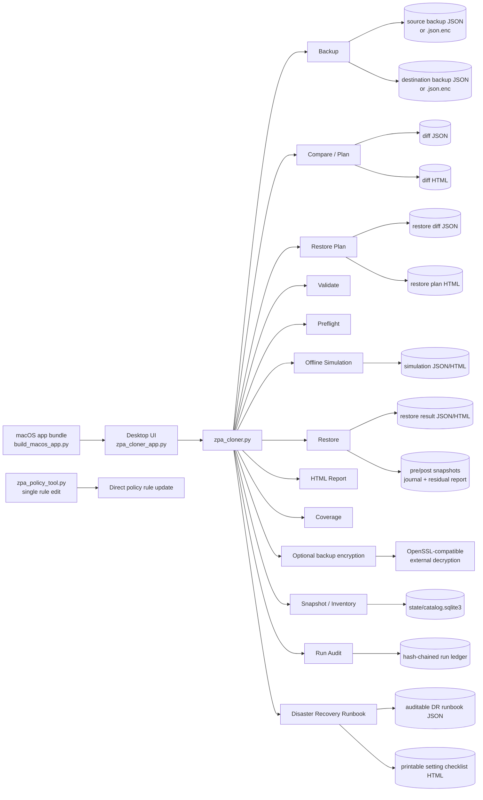

## Tenant Safety Boundary

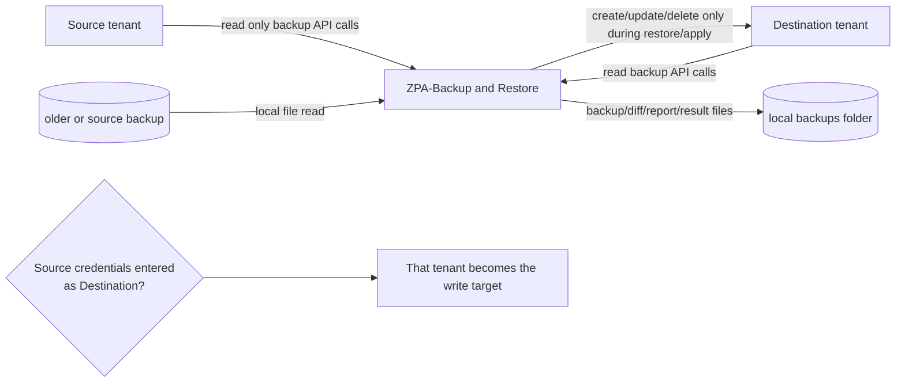

In the normal source-to-destination workflow, Source is only read. The only way Source can be modified by the restore workflow is if the operator intentionally or accidentally enters Source credentials in the Destination tab or target environment variables.

## Main UI Workflow

The fixed left pane uses six focused tabs: `Workflow` for ordered actions,
`Tenants` for source/destination credentials, `Options` for backup policy scope
and safeguards, `Scope` for selective restore, `Artifacts` for generated or
selected files, and `Status` for environment readiness. Each tab fits at the
minimum supported window size without vertical scrolling. Command output
scrolls independently in the right-side Activity panel.

Hover over a tab, action, field, artifact, or safeguard to see a short
explanation. The same explanations appear when a supported control receives
keyboard focus. Tooltips clarify behavior and safety impact; every core action
remains available through a visible, self-contained label.

After selecting a Desired backup, `DR Runbook` creates the canonical JSON and
printable HTML checklist without tenant credentials. `Open DR Checklist` opens
the generated guide. The Workflow tab keeps the DR action in its existing
Review row, so the left panel remains non-scrolling.

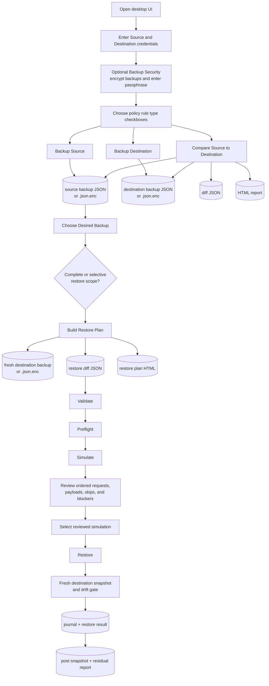

When backup encryption is enabled, source and destination backup files use `.json.enc` instead of `.json`. The passphrase is entered in the masked Backup Security field or supplied through the configured environment variable.

## Backup And Compare

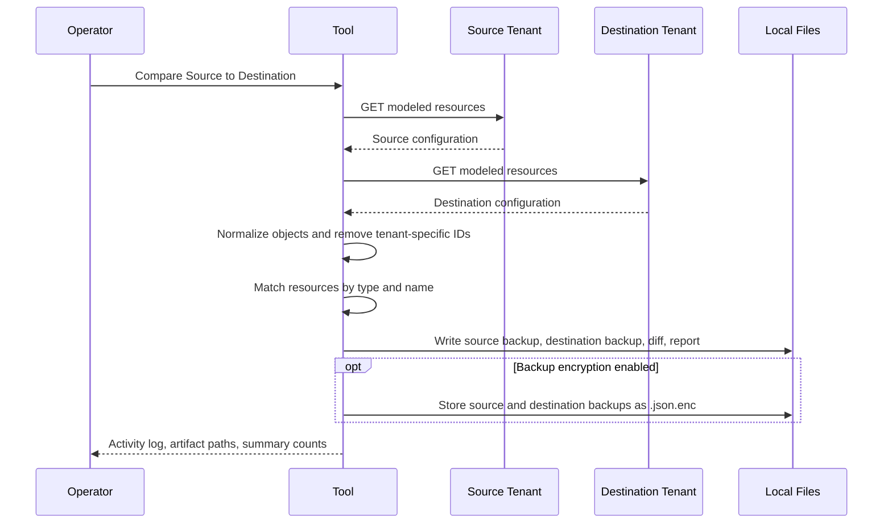

Backup and compare do not write to either tenant.

## Encrypted Backup Storage

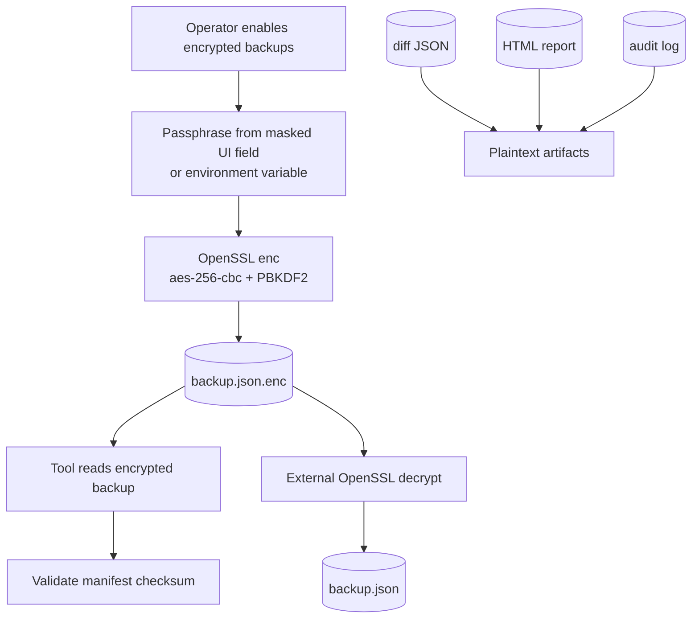

Encrypted backups are designed to be portable. They can be decrypted without this tool by setting the passphrase environment variable and running OpenSSL:

```sh
export ZPA_BACKUP_PASSPHRASE="..."
openssl enc -d -aes-256-cbc -pbkdf2 -iter 200000 -md sha256 \
  -in backups/<timestamp>-source.json.enc \
  -out backups/<timestamp>-source.json \
  -pass env:ZPA_BACKUP_PASSPHRASE
```

Only backup JSON files are encrypted by `--encrypt-backups`. Diff JSON, HTML reports, restore result files, and HTTP audit logs remain plaintext and must be protected separately.

## Restore From A Past Snapshot

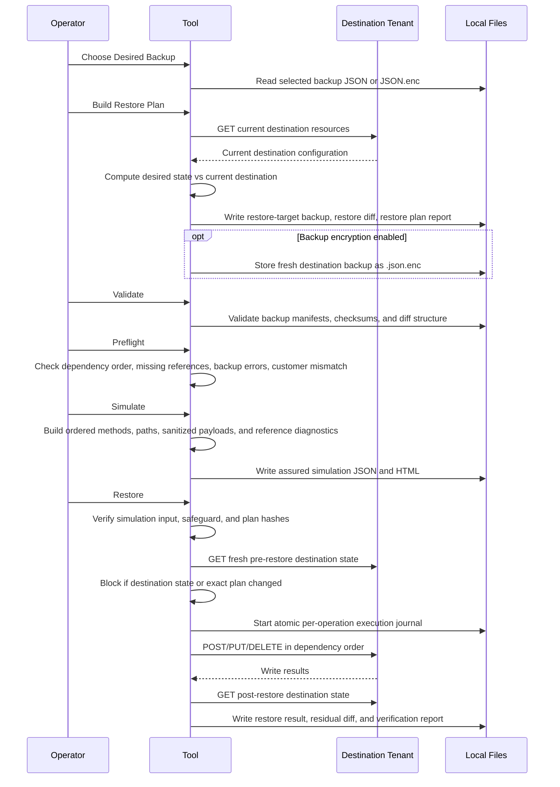

Restore from a past snapshot does not require live Source tenant access. It uses the chosen backup file as the desired state and writes only to the configured Destination tenant.

## Validation And Preflight Gates

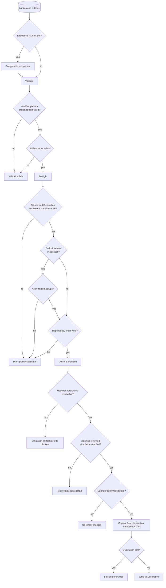

Validate decrypts encrypted backups before checking file integrity and structure. Preflight checks whether the restore set is internally consistent. The offline simulation then verifies request ordering, payload preparation, cross-tenant ID mapping, and safety skips before write operations are allowed.

## Restore Write Order

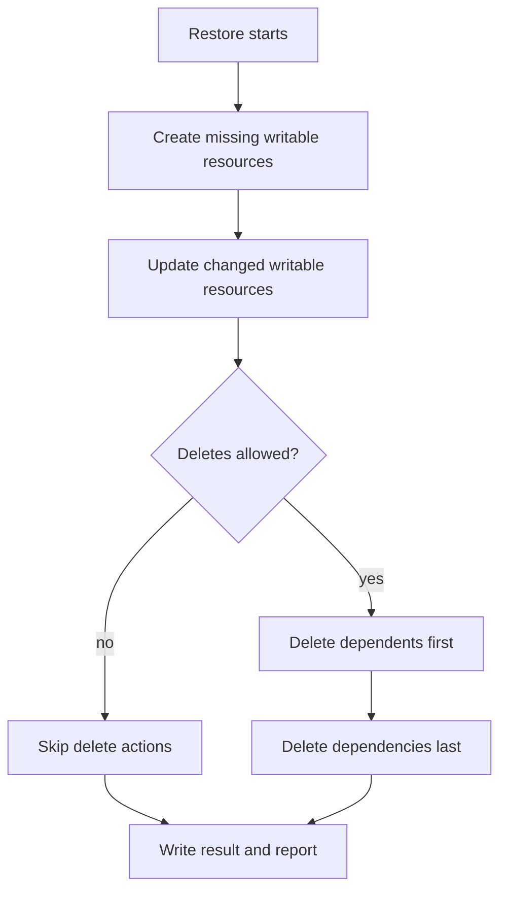

Creates and updates follow the declared migration order so dependencies exist before dependent resources are written. Deletes run in reverse order so dependents are removed before dependencies.

## Resource Scope

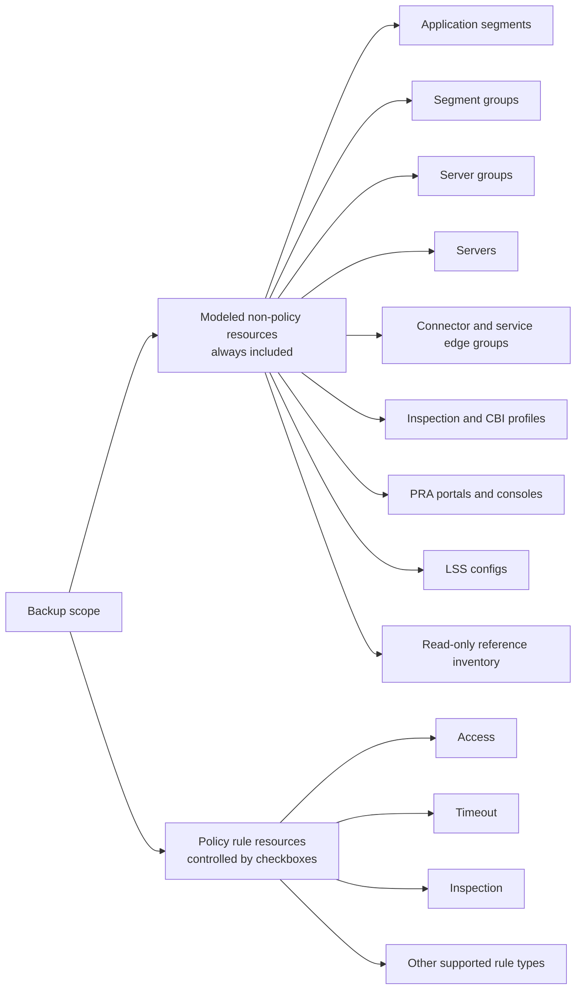

The policy checkboxes affect policy rule types only. They do not exclude application segments, server groups, segment groups, or other modeled non-policy resources.

Backup policy scope and restore selection are separate. The Scope tab or
`--select`/`--select-resource` filters which differences may become restore
operations. A selective diff persists canonical stable identities and is
recomputed by preflight. Dependencies remain validation-only unless
`--include-dependencies` is selected, and policy bulk reorder remains excluded
unless `--restore-policy-order` is selected.

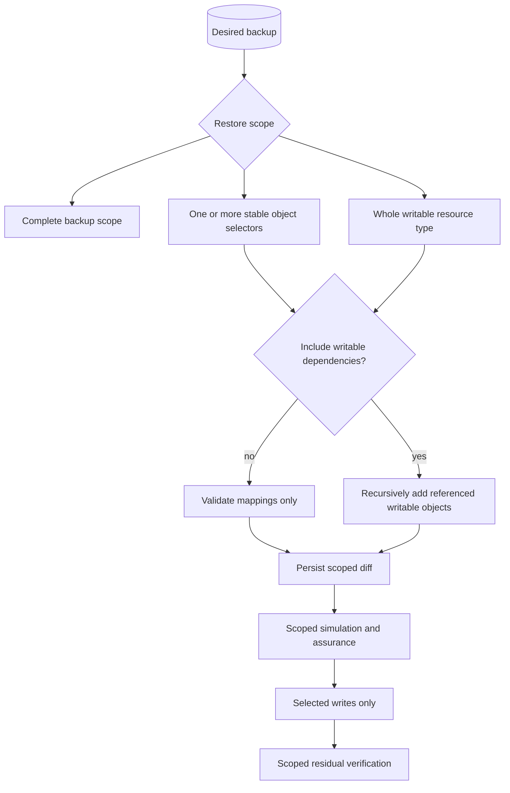

## Safeguards

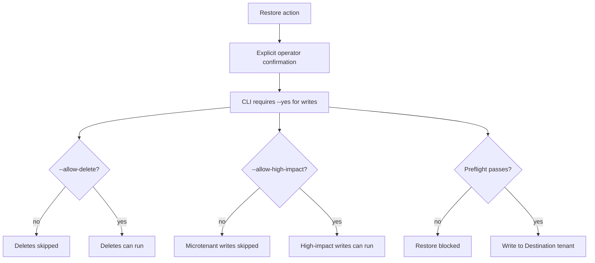

Default behavior is conservative: no writes without explicit confirmation, deletes skipped unless enabled, and high-impact microtenant writes skipped unless enabled.

## Artifact Lifecycle

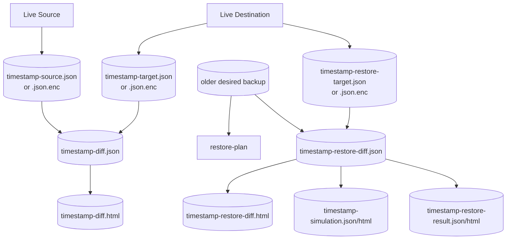

Every significant operation writes local artifacts so an operator can review what happened and rerun validation/reporting from files.

## Disaster Recovery Checklist Flow

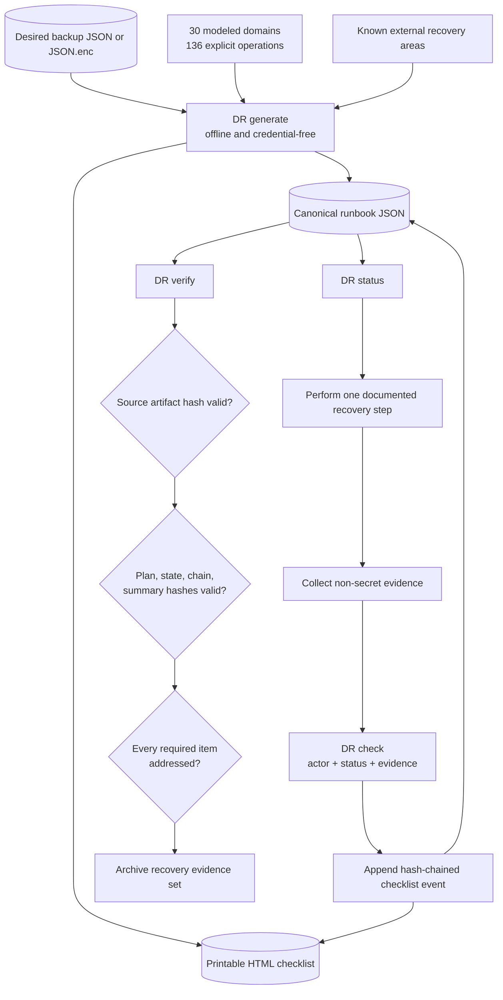

The checklist contains readiness and change-control gates, every modeled
domain, every captured setting, known exclusions, post-restore technical and
business validation, audit-ledger verification, evidence retention, and final
acceptance. Automated commands are emitted only for stable writable resources;
all other modes have explicit manual or verification procedures.

## Single Rule Edit

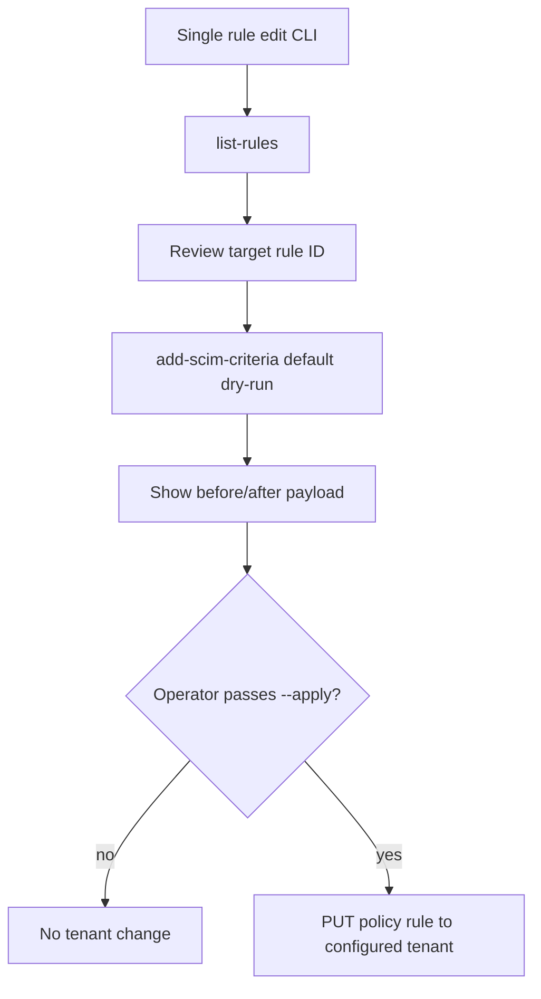

The single-rule tool is separate from backup/restore. It writes only when `--apply` is passed and uses the single-tenant `ZSCALER_*` credential set.

## Command Summary

| Feature | UI action | CLI command | Tenant write risk |
| --- | --- | --- | --- |
| Backup Source | `Backup Source` | `zpa_cloner.py backup source` | None |
| Backup Destination | `Backup Destination` | `zpa_cloner.py backup target` | None |
| Compare tenants | `Compare Source to Destination` | `zpa_cloner.py plan` | None |
| Restore from snapshot | `Build Restore Plan` | `zpa_cloner.py restore-plan` | None |
| Restore selected objects | `Scope` + `Build Restore Plan` | `zpa_cloner.py restore-plan --select <selector>` | None while planning; Destination only after reviewed restore |
| Validate files | `Validate` | `zpa_cloner.py validate` | None |
| Preflight restore | `Preflight` | `zpa_cloner.py preflight` | None |
| Simulate restore | `Simulate` | `python3 -m zpa_backup_restore simulate` | None; credentials not required |
| Apply restore | `Restore` | `zpa_cloner.py restore --simulation <reviewed.json> --yes` | Destination only |
| Generate report | `Report` | `zpa_cloner.py report` | None |
| Generate DR runbook | `DR Runbook` | `python3 -m zpa_backup_restore dr generate --source-backup <backup>` | None; credentials not required |
| Show coverage | `Coverage` | `zpa_cloner.py coverage` | None |
| Edit one rule | Not part of main UI | `zpa_policy_tool.py add-scim-criteria --apply` | Configured single tenant |
