# ZPA-Backup and Restore Process

ZPA-Backup and Restore is an independent tool. It is not affiliated with, endorsed by, sponsored by, certified by, or supported by Zscaler, Inc. It is provided "as is", without warranty of any kind. See [../DISCLAIMER.md](../DISCLAIMER.md).

This page describes how the tool operates, which actions read or write a tenant, and how backup, restore, validation, and reporting fit together.

## Feature Map

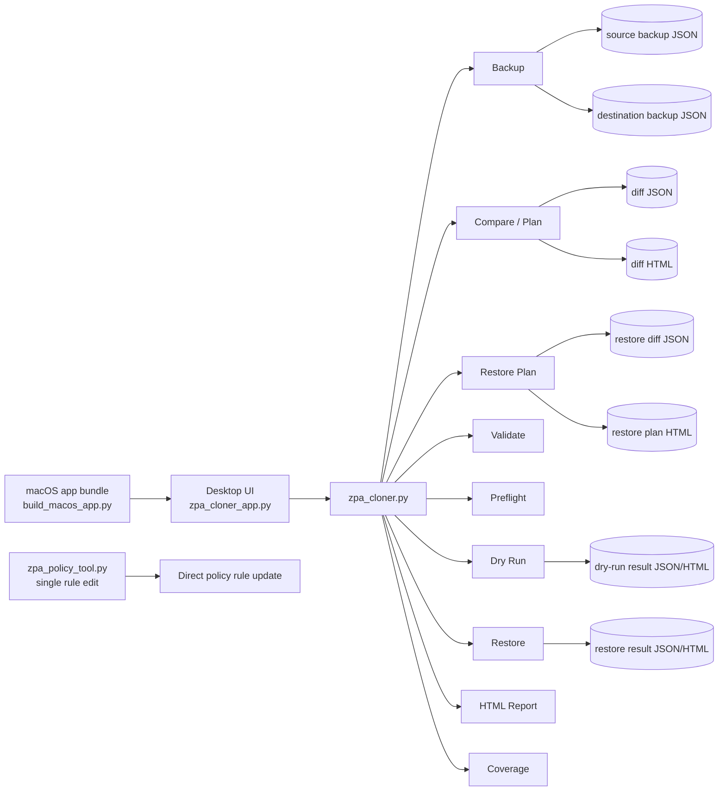

## Tenant Safety Boundary

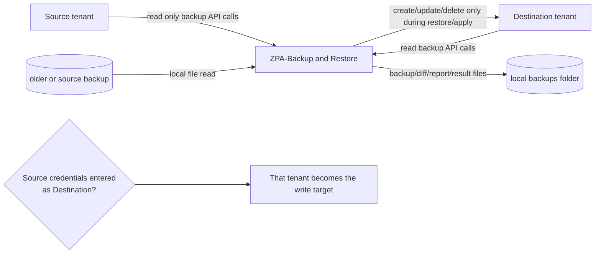

In the normal source-to-destination workflow, Source is only read. The only way Source can be modified by the restore workflow is if the operator intentionally or accidentally enters Source credentials in the Destination tab or target environment variables.

## Main UI Workflow

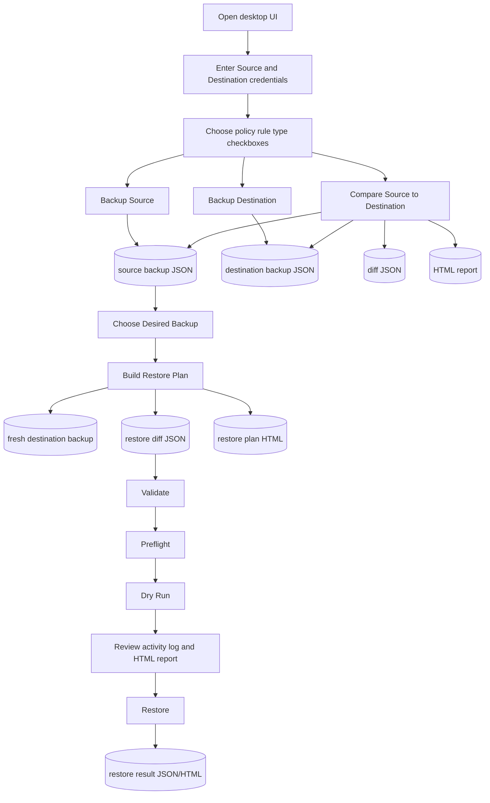

## Backup And Compare

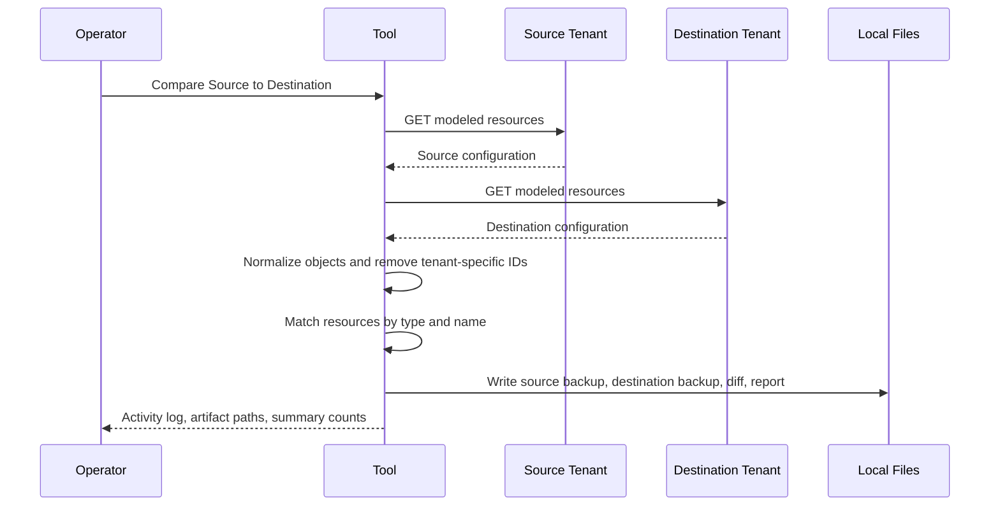

Backup and compare do not write to either tenant.

## Restore From A Past Snapshot

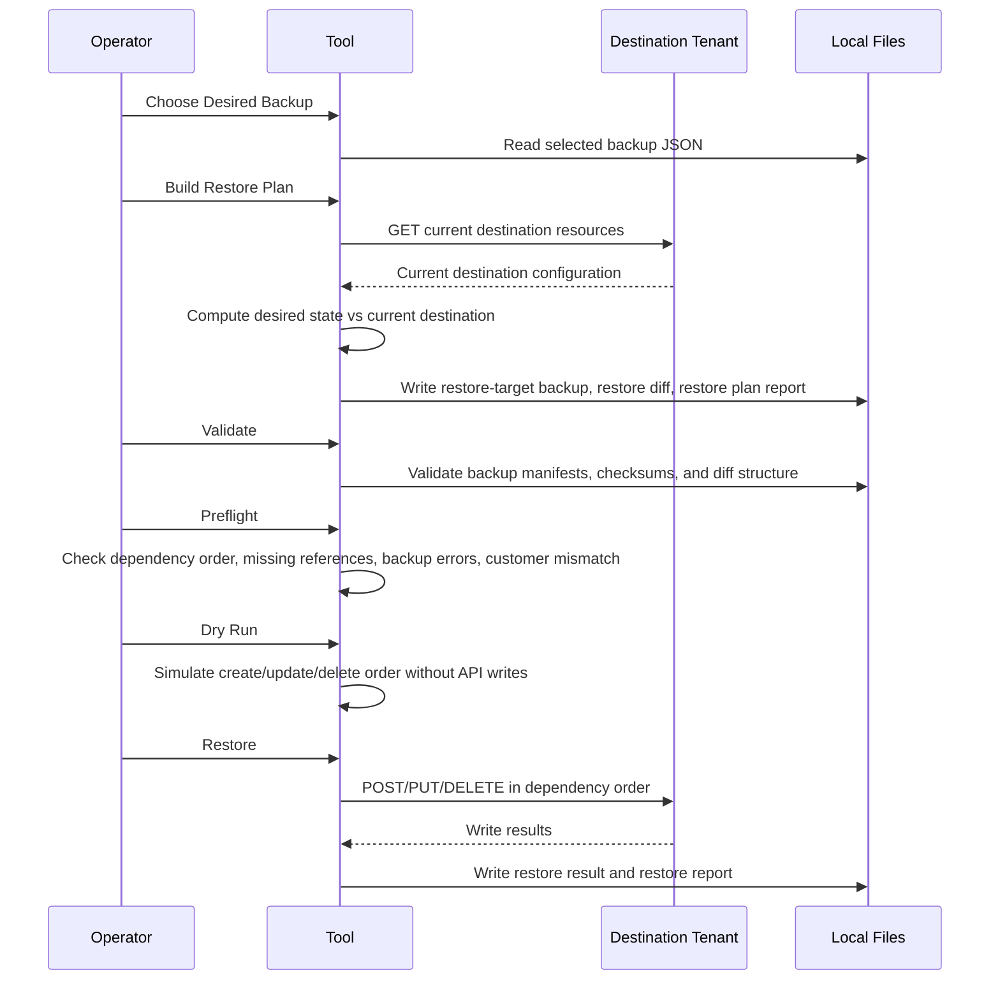

Restore from a past snapshot does not require live Source tenant access. It uses the chosen backup file as the desired state and writes only to the configured Destination tenant.

## Validation And Preflight Gates

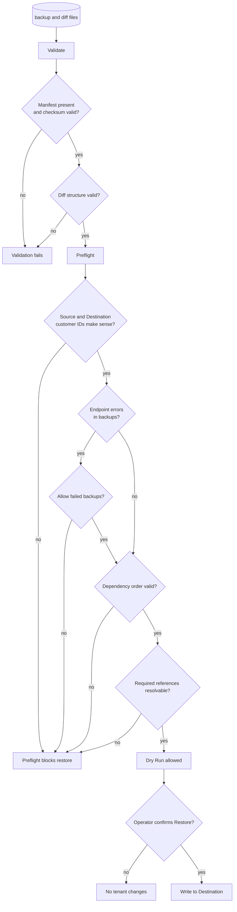

Validate checks file integrity and structure. Preflight checks whether the restore set is safe and internally consistent before write operations are allowed.

## Restore Write Order

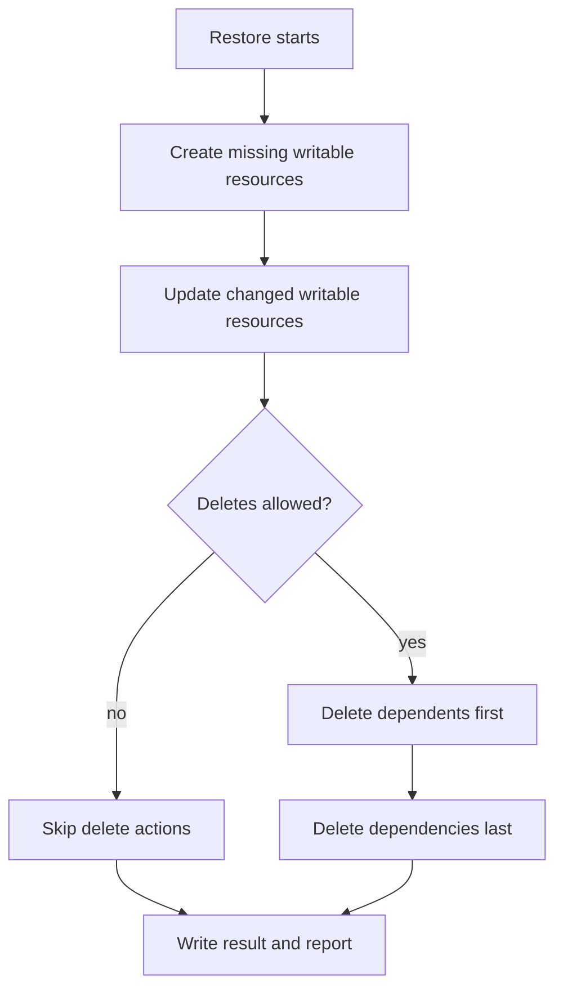

Creates and updates follow the declared migration order so dependencies exist before dependent resources are written. Deletes run in reverse order so dependents are removed before dependencies.

## Resource Scope

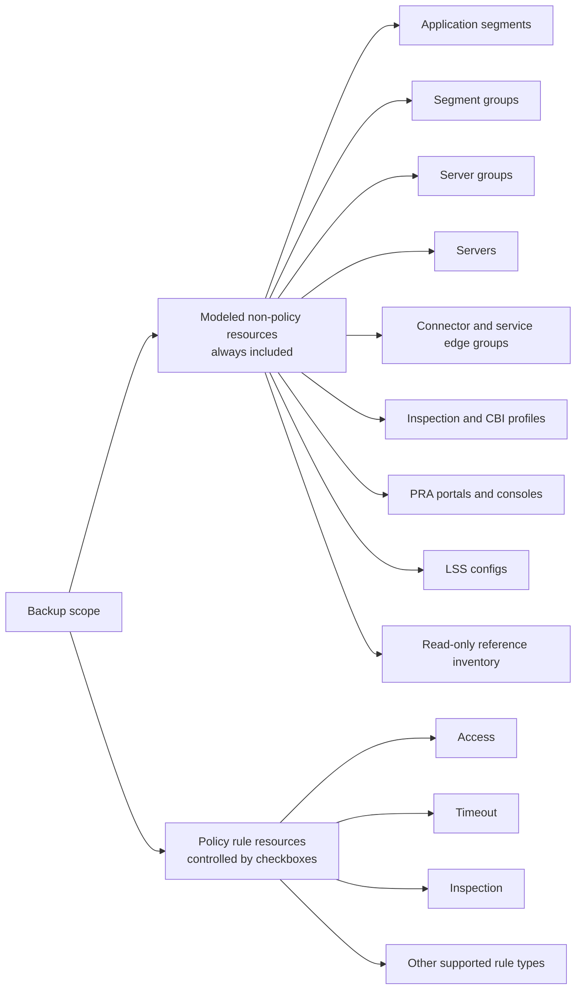

The policy checkboxes affect policy rule types only. They do not exclude application segments, server groups, segment groups, or other modeled non-policy resources.

## Safeguards

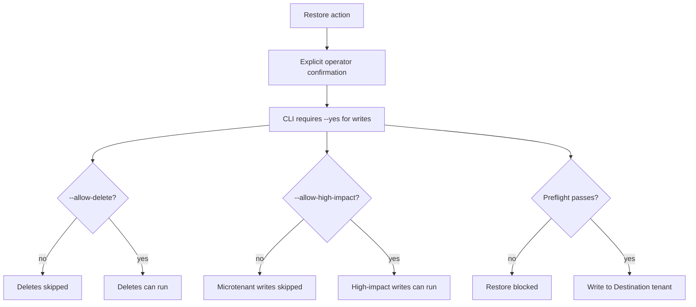

Default behavior is conservative: no writes without explicit confirmation, deletes skipped unless enabled, and high-impact microtenant writes skipped unless enabled.

## Artifact Lifecycle

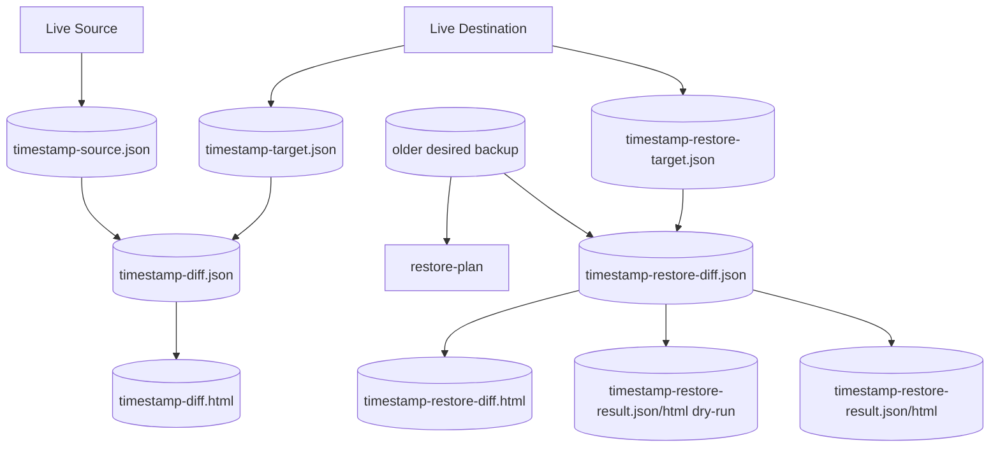

Every significant operation writes local artifacts so an operator can review what happened and rerun validation/reporting from files.

## Single Rule Edit

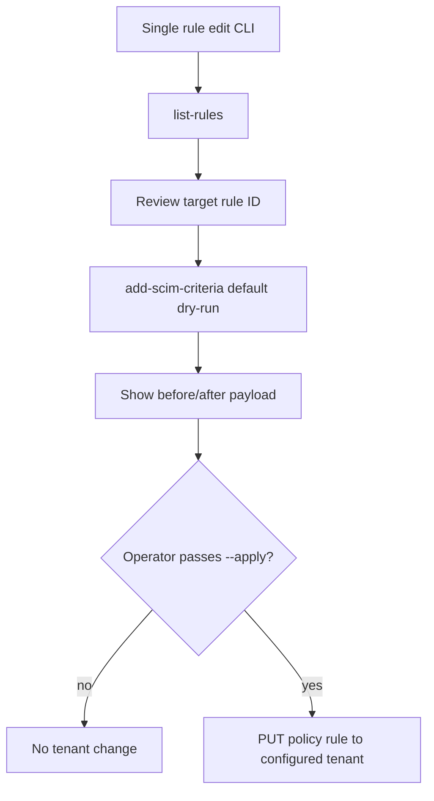

The single-rule tool is separate from backup/restore. It writes only when `--apply` is passed and uses the single-tenant `ZSCALER_*` credential set.

## Command Summary

| Feature | UI action | CLI command | Tenant write risk |
| --- | --- | --- | --- |
| Backup Source | `Backup Source` | `zpa_cloner.py backup source` | None |
| Backup Destination | `Backup Destination` | `zpa_cloner.py backup target` | None |
| Compare tenants | `Compare Source to Destination` | `zpa_cloner.py plan` | None |
| Restore from snapshot | `Build Restore Plan` | `zpa_cloner.py restore-plan` | None |
| Validate files | `Validate` | `zpa_cloner.py validate` | None |
| Preflight restore | `Preflight` | `zpa_cloner.py preflight` | None |
| Simulate restore | `Dry Run` | `zpa_cloner.py restore --dry-run` | None |
| Apply restore | `Restore` | `zpa_cloner.py restore --yes` | Destination only |
| Generate report | `Report` | `zpa_cloner.py report` | None |
| Show coverage | `Coverage` | `zpa_cloner.py coverage` | None |
| Edit one rule | Not part of main UI | `zpa_policy_tool.py add-scim-criteria --apply` | Configured single tenant |
